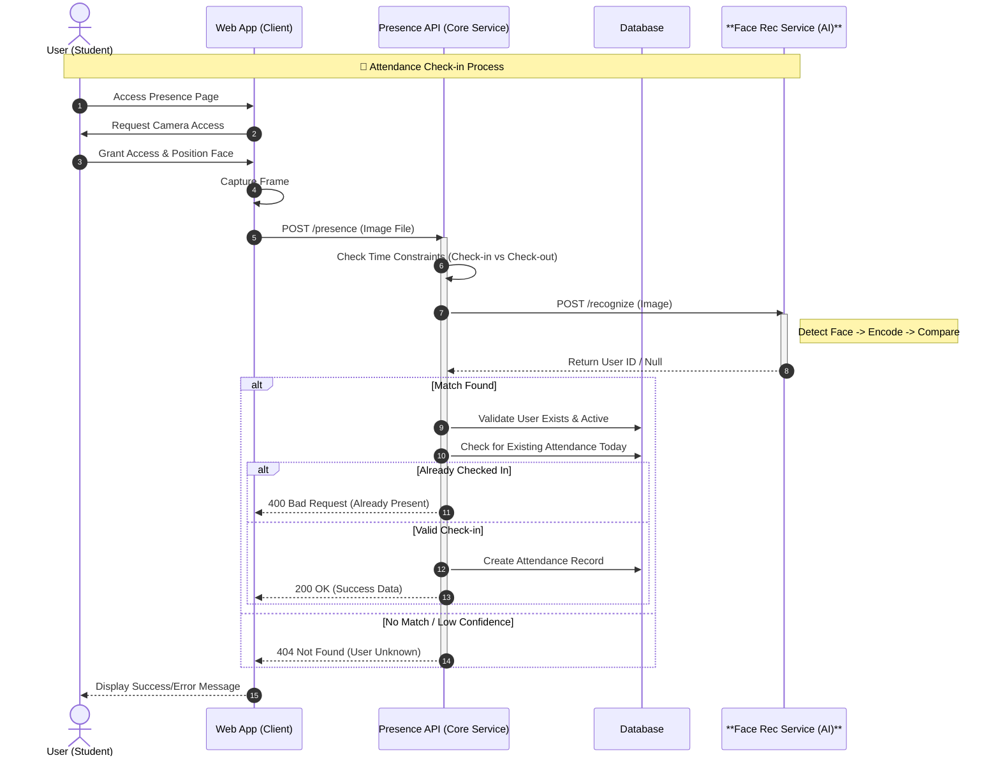

# Face Recognition API

A Flask-based REST API designed for face recognition and user management. This application provides endpoints to register new users with their face data, recognize users from uploaded images, and manage user data.

## Features

- **User Registration/Update**: Register a new user or update an existing one by uploading a face image.
- **Face Recognition**: Identify a registered user from an uploaded image.
- **User Management**: Delete user data efficiently.

## 🔄 System Business Flow

The following diagram places this Face Recognition Service within the context of the larger **Presence System**, illustrating its role in the recognition loop.



## Tech Stack

- **Framework**: Flask
- **Computer Vision**: OpenCV, face_recognition
- **Machine Learning**: scikit-learn
- **Data Processing**: NumPy, Joblib

## Installation

1.  **Clone the repository** (if applicable) or download the source code.

2.  **Install Dependencies**:
    Ensure you have Python installed, then run:
    ```bash
    pip install -r requirements.txt
    ```
    *Note: The `face_recognition` library might require `cmake` to be installed on your system particularly for dlib compilation.*

## Usage

1.  **Start the Server**:
    ```bash
    python app.py
    ```
    The server will start in debug mode at `http://127.0.0.1:5000/`.

2.  **API Endpoints**:

    ### 1. Check API Status
    - **URL**: `/`
    - **Method**: `GET`
    - **Response**:
      ```json
      {
        "message": "Face Recognition API"
      }
      ```

    ### 2. Register / Update User
    - **URL**: `/update`
    - **Method**: `POST`
    - **Content-Type**: `multipart/form-data`
    - **Parameters**:
      - `user_id`: (Text) The unique ID of the user.
      - `image`: (File) The image file containing the user's face.
    - **Success Response**:
      ```json
      {
        "message": "Pengguna <user_id> berhasil diperbarui!"
      }
      ```

    ### 3. Recognize User
    - **URL**: `/recognize`
    - **Method**: `POST`
    - **Content-Type**: `multipart/form-data`
    - **Parameters**:
      - `image`: (File) The image file to recognize.
    - **Success Response**:
      ```json
      {
        "data": <user_id>
      }
      ```
    - **Error Response** (if no match found):
      - 404/400 with message "Tidak ada wajah yang cocok ditemukan".

    ### 4. Delete User
    - **URL**: `/delete`
    - **Method**: `DELETE`
    - **Content-Type**: `application/json`
    - **Body**:
      ```json
      {
        "user_id": <user_id>
      }
      ```
    - **Success Response**:
      ```json
      {
        "message": "Pengguna <user_id> berhasil dihapus!"
      }
      ```

## Project Structure

```
presence--face-recognition/
├── app.py                 # Application entry point
├── requirements.txt       # Project dependencies
├── app/                   # Core application logic
│   ├── __init__.py        # App initialization & global error handlers
│   ├── routes.py          # General routes
│   └── errors.py          # App-level error definitions
└── recognition/           # Face recognition module
    ├── routes.py          # Recognition-specific routes (update, recognize, delete)
    ├── utils.py           # Logic for encoding, training, and prediction
    └── errors.py          # Recognition-specific error definitions
```
